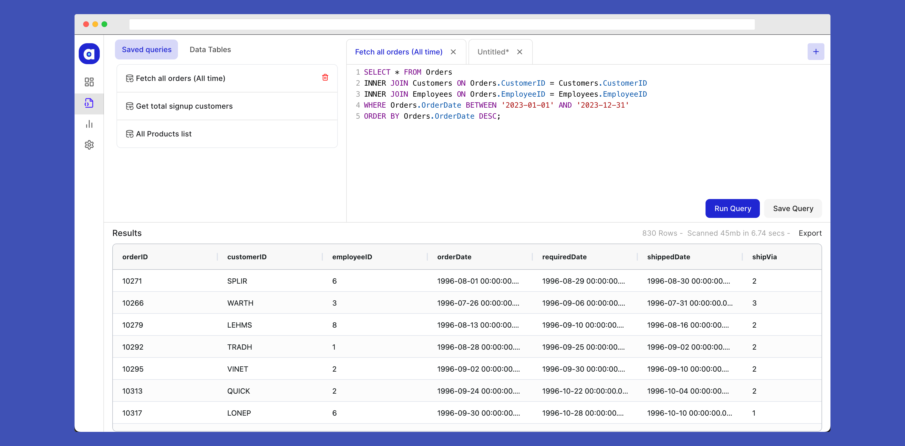

# SQL Editor on VueJS

Live URL - https://sql-editor.mdsaban.com/editor



This is a web-based SQL editor application for runing SQL queries and displaying the results of said query. Currently it has dummy json data taken from [here](https://github.com/graphql-compose/graphql-compose-examples/tree/master/examples/northwind/data/json)

### Libraries Used
 - [NuxtJS](https://v2.nuxt.com/) (VueJS Framework)
 - [Vuetify](https://v2.vuetifyjs.com/en/) (UI component framework)
 - [CodeMirror](https://codemirror.net/5/) (For SQL query input)
 - [AG Grid](https://www.ag-grid.com/vue-data-grid/) (For data table)


## Features
-   **Overall Layout**: There are 3 sections mainly.
	- First one if where user can see their saved queries and data tables/sources.
	- Second section is the SQL editor for writing multiple queries, with tabs. Since the users want to run multiple queries at a time.
	- Third is result section, where the results are shown for the query that is run by the user.
	-
-  **Saved Queries**: The saved queries of the user will be shown here, they can re-run it or delete it anytime once they are not needed.

-  **Data tables/sources**: It displays the list of tables and the columns in it, so that user can quickly reference to it when they are writing a query. They can also search through these data using the search feature provided.

-  **Run Query**: User can write a query and the run it.

-  **Save Query**: User can save their queries. And they can see it in `Saved Queries` section.

- **Results Section**: This section shows the result of the given query in a tabular data. We display 3 things here
	- Query data (We use virtualised data to **render a large amount of rows in your application without breaking the browser**)
	- Time taken to run this query
	- Total data scanned to get the result

-  **Export the result**: Allow users to export the results of a query in JSON, XML, and CSV formats.

#### Yet to be implemented
1. Allow rename of the query before saving it
2. Export results to JSON and XML (Currently it has only CSV export)
3. Allow users to see query history somewhere
4. Add Dark/light theme toggle

## Load Time
- **GTMetrix** - I've used GTMTerix for checking the load time. The fully loaded time is `1.6s`, and other metrics are as below
	- First Contentful Paint: 587ms
	- Time to Interactive: 1.1s
	-	Onload Time: 1.3s
	- Speed Index: 952ms
	- Cumulative Layout Shift: 0.18


- **DevTools** - I've also checked the DOM loadtime using the chrome devtools. For both without caching (if the user loads for the first time) and with caching. Here are the results of it.
	- Without caching

	
	- With caching

	

## Optimisations
- Replaced default table of vuetify with ag-grid library which can show Virtualized data tables. **Why**? - So that large chunk of rows/data can be rendered without making the DOM heavy, and not making the webapp slow.
- Refactored and optimised the code. **Problem**? - new SQL editor was getting initialised for all the opened tabs. For example if there are 7 query tabs open, then there were 7 different sql editors input in the DOM. **Solution**? - Made sql editor form as sibiling of SQLEditor tabs and only render one input form and change the query inside it.
-	Reduced the loadtime by removing the framework's default fonts and icon library that were not being used. This helped in reducing the render-blocking resources.

## Build Setup
```
# install dependencies
$ yarn

# serve with hot reload at localhost:3000
$ yarn dev

# build for production and launch server
$ yarn build
$ yarn start

# generate static project
$ yarn generate
``````
